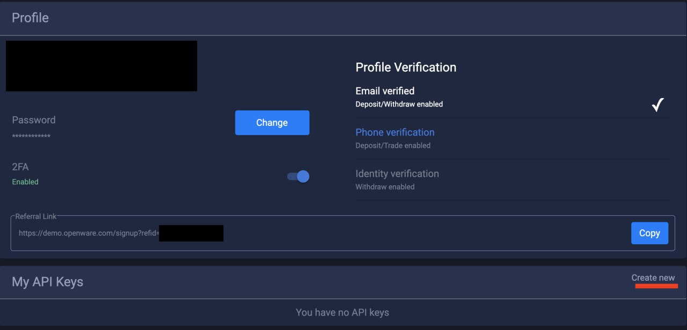

# Barong API keys creation and usage

This document explains how to create an API key on barong using the UI or command line tool.
This API key can be used to access microservices in the cluster protected by barong authentication.
You can find below an example how to use the API key.

## How to create API key ?

### Using UI (recommended option)

1. Find API keys section (often located on profile page).



2. Create your API key and securely save Access Key and Secret Key


### Using API (use this option in case your frontend doesn't support API keys feature)

1. Install [httpie](https://httpie.org/)

2. Login into your account using httpie

```bash
http --session barong_session https://your.domain/api/v2/barong/identity/sessions \
  email=your@email.com password=changeme otp_code=000000
```
Example of response:
```json
{
    "created_at": "2020-06-01T07:01:20Z",
    "csrf_token": "f5b36515a428328e199a",
    "data": "{\"language\":\"en\"}",
    "data_storages": [],
    "email": "your@example.com",
    "labels": [
        {
            "created_at": "2020-06-01T07:01:45Z",
            "key": "email",
            "scope": "private",
            "updated_at": "2020-06-01T07:01:45Z",
            "value": "verified"
        }
    ],
    "level": 5,
    "otp": true,
    "phones": [
        {
            "country": "FR",
            "number": "33*****0471",
            "validated_at": "2020-06-01T07:03:18.000Z"
        }
    ],
    "profiles": [],
    "referral_uid": null,
    "role": "member",
    "state": "active",
    "uid": "IDAF1AED1A42",
    "updated_at": "2020-10-22T18:01:09Z"
}
```

3. Validate your session

```bash
http --session barong_session https://your.domain.com/api/v2/peatio/account/balances
```

4. Create your API key

```
http --session barong_session https://your.domain.com/api/v2/barong/resource/api_keys \
  algorithm=HS256 totp_code=681757 x-csrf-token:f5b36515a428328e199a
```

Expected response:

```json
{
    "algorithm": "HS256",
    "created_at": "2019-12-23T12:22:15Z",
    "kid": "61d025b8573501c2", // Access Key
    "scope": [],
    "secret": {
        "auth": null,
        "data": {
            "value": "2d0b4979c7fe6986daa8e21d1dc0644f" // Secret Key
        },
        "lease_duration": 2764800,
        "lease_id": "",
        "metadata": null,
        "renewable": false,
        "warnings": null,
        "wrap_info": null
    },
    "state": "active",
    "updated_at": "2019-12-23T12:22:15Z"
}
```

5. Securely save Access Key and Secret Key

## How to use API key ?

To authenticate using API key you need to pass next 3 headers:

| Header           | Description                                                  |
| ---------------- | ------------------------------------------------------------ |
| X-Auth-Apikey    | Access Key for API key (see 'How to create API key section ?') |
| X-Auth-Nonce     | Timestamp in milliseconds (can be passed as a string)        |
| X-Auth-Signature | HMAC-SHA256, calculated using concatenation of X-Auth-Nonce and Access Key |

1. Generate X-Auth-Nonce - unique string (e.g current unix timestamp)

```bash
date +%s%3N
1584524005143
```

Nonce will be validated on server side to be not older than 5 seconds from the generation moment

2. Calculate X-Auth-Signature header.

X-Auth-Signature is HMAC-SHA256, calculated using concatenation of X-Auth-Nonce and Access Key.

```ruby
nonce = (Time.now.to_f * 1000).to_i.to_s # timestamp in milliseconds, ex: 1584524005143
access_key = '61d025b8573501c2' # Access Key from 'How to create API key section ?'
secret_key = '2d0b4979c7fe6986daa8e21d1dc0644f' # Secret Key from 'How to create API key section ?'
OpenSSL::HMAC.hexdigest("SHA256", secret_key, nonce + access_key)
# => "bd42b945e095880e28d046846dbecf655fdf09d95a396a24fe6fe1df42f15d13" 
```

3. Pass your headers in httpie (note `--session` is not needed anymore)

```
http https://your.domain.com/api/v2/peatio/account/balances \
  "X-Auth-Apikey: 61d025b8573501c2" \
  "X-Auth-Nonce: 1584524005143" \
  "X-Auth-Signature: bd42b945e095880e28d046846dbecf655fdf09d95a396a24fe6fe1df42f15d13"
```
