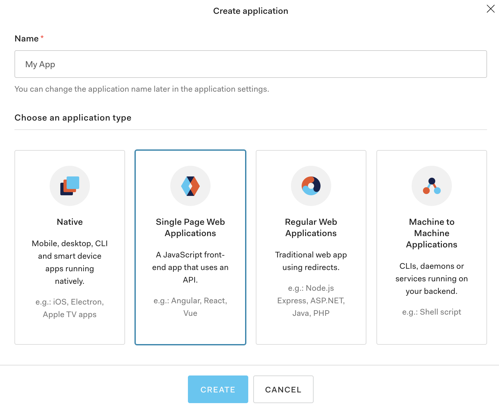
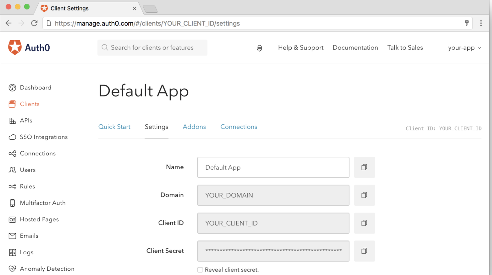
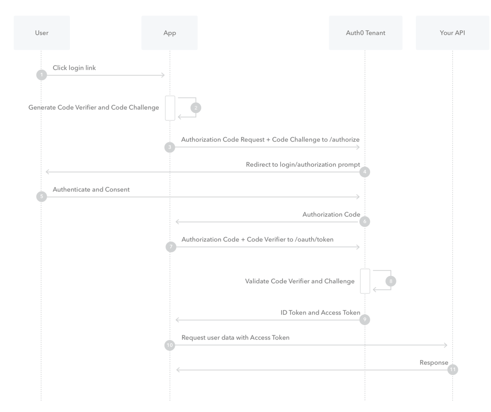

# Auth0 integration

## How to create an application

When you signed up for Auth0, a new application was created for you, or you could have created a new one (the most appropriate application for our structure is Single Page Application).

You will need some details about that application to communicate with Auth0. You can get these details from the Application Settings section in the Auth0 dashboard.

You should put `auth0_domain` from the Domain field and `auth0_client_id` from the Client ID field

For a single page application better to use authorization code flow with proof key for code exchange.

## Authorization Code Flow with Proof Key for Code Exchange (PKCE)
When public clients request Access Tokens, some additional security concerns are posed that are not mitigated by the Authorization Code Flow alone. This is because single-page apps cannot securely store a Client Secret because their entire source is available to the browser.

### How it works

Because the PKCE-enhanced Authorization Code Flow builds upon the standard Authorization Code Flow, the steps are very similar.

1. The user clicks Login within the application.

2. Auth0's SDK creates a cryptographically-random code_verifier and from this generates a code_challenge.

3. Auth0's SDK redirects the user to the Auth0 Authorization Server (/authorize endpoint) along with the code_challenge.

4. Your Auth0 Authorization Server redirects the user to the login and authorization prompt.

5. The user authenticates using one of the configured login options and may see a consent page listing the permissions Auth0 will give to the application.

6. Your Auth0 Authorization Server stores the code_challenge and redirects the user back to the application with an authorization code, which is good for one use.

7. Auth0's SDK sends this code and the code_verifier (created in step 2) to the Auth0 Authorization Server (/oauth/token endpoint).

8. Your Auth0 Authorization Server verifies the code_challenge and code_verifier.

9. Your Auth0 Authorization Server responds with an ID Token and Access Token (and optionally, a Refresh Token).

10. Your application can use the Access Token to call an API to access information about the user.

11. The API responds with requested data.

You can try to call your [API using the authorization Code Flow with PKCE](https://auth0.com/docs/flows/call-your-api-using-the-authorization-code-flow-with-pkce).

Also you can find a link with [Authentication API description](https://auth0.com/docs/api/authentication#introduction) here.
