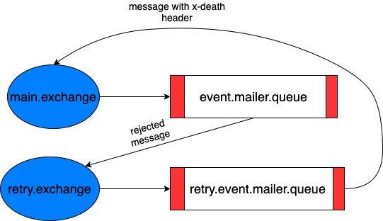

# Barong mailer

Mailer in the barong app is a deamon listening events from RabbitMQ, it renders emails using templates in the language set in user profile (if possible) and send emails.

This guide explains the basics of using mailer to manage events from rubykube Event API.

It is usually used by following components:

- [Barong](https://www.openware.com/sdk/docs.html#barong)
- [Peatio](https://www.openware.com/sdk/docs.html#peatio)

Read more about [Peatio Event API](https://www.openware.com/sdk/docs/peatio/api/event-api.html).
Read more about [Barong Event API](https://www.openware.com/sdk/docs/barong/general/event-api.html).

## Concepts

An _Event_ is a message produced to message broker in [RFC7515](https://tools.ietf.org/html/rfc7515).

Events have the following structure:

```JSON
{
  "payload": "string",
  "signatures": [
    {
      "header": {
        "kid":"string"
      },
      "protected":"string",
      "signature":"string"
    }
  ]
}
```

## Deep dive

By specification defined in _RFC7515_ we can build a JSON Web Token.

After parsing of prebuilt JWT, you will receive this payload with this structure.

```JSON
{
  "iss": "string",
  "jti": "string",
  "iat": 1567777420,
  "exp": 1567777480,
  "event": {
    "record": {
      "user": {
        "uid": "string",
        "email": "string",
      },
      "language": "string",
    },
    "name": "string"
  }
}
```

**Note:** All events should be properly signed using RS256 private key.

Mailer validates the signature of each upcoming event.

Further, we will see that mailer user can work with this payload directly.

```JSON
{
  "record": {
    "user": {
      "uid": "UID12345678",
      "email": "johndoe@example.com"
    },
    "language": "EN"
  },
  "changes": {},
  "name": "string"
}
```

## Run

| Variable                             | Description                    | Required | Default             |
| ------------------------------------ | ------------------------------ | -------- | ------------------- |
| `BARONG_EVENT_API_RABBITMQ_HOST`     | Host of RabbitMQ daemon        | _no_     | `localhost`         |
| `BARONG_EVENT_API_RABBITMQ_PORT`     | Port of RabbitMQ daemon        | _no_     | `5672`              |
| `BARONG_EVENT_API_RABBITMQ_USERNAME` | RabbitMQ username              | _no_     | `guest`             |
| `BARONG_EVENT_API_RABBITMQ_PASSWORD` | RabbitMQ password              | _no_     | `guest`             |
| `BARONG_SMTP_PASSWORD`               | Password used for auth to SMTP | _yes_    |                     |
| `BARONG_SMTP_PORT`                   | Post of SMTP server            | _no_     | `25`                |
| `BARONG_SMTP_HOST`                   | Host of SMTP server            | _no_     | `smtp.sendgrid.net` |
| `BARONG_SMTP_USER`                   | User used for auth to SMTP     | _no_     | `apikey`            |
| `BARONG_SENDER_EMAIL`                | Email address of mail sender   | _yes_    |                     |
| `BARONG_SENDER_NAME`                 | Name of mail sender            | _no_     | `Barong`            |

```sh
./bin/mailer --config=config/mailer.yml run
```

Mailer creates one queue and bind pre-defined exchanges to it.

## Configuration

Mailer is a flexible tool, you can cusomize alomost everything. Biggest part of customizations defined in `mailer.yml`, but you can also modify templates.

Each Event API provider uses own AMQP exchange and algorithm to sign payload.

```yaml
exchanges:
  barong:
    name: barong.events.system
    signer: peatio
```

Using keychain algorithms and defined public keys for each provider mailer will validate the data.

```yaml
keychain:
  barong:
    algorithm: RS256
    value: "public_key"
```

In `events` you may define any event type from Event API providers and prepare email template for it.

```yaml
events:
  - name: Email Confirmation
    key: user.email.confirmation.token
    exchange: barong
    templates:
      EN:
        subject: Registration Confirmation
        template_path: email_confirmation.en.html.erb
      RU:
        subject: Подтверждение Регистрации
        template_path: email_confirmation.ru.html.erb
```

The simpliest mailer configuration will look like this one:

```yaml
keychain:
  barong:
    algorithm: RS256
    value: "changeme"
  peatio:
    algorithm: RS256
    value: "changeme"

exchanges:
  barong:
    name: barong.events.system
    signer: barong

events:
  - name: Email Confirmation
    key: user.email.confirmation.token
    exchange: barong_system
    templates:
      en:
        subject: Registration Confirmation
        template_path: email_confirmation.en.html.erb
      ru:
        subject: Подтверждение Регистрации
        template_path: email_confirmation.ru.html.erb
```

## Templates

Mailer exposes few variables for usage inside the templates.

| Variable   | Description                                  |
| ---------- | -------------------------------------------- |
| `@user`    | User related to this email                   |
| `@record`  | Created user up-to-date attributes.          |
| `@changes` | The changed user attributes and their values |

### User

User with related profile.

| Variable    |                               |
| ----------- | ----------------------------- |
| uid         | Unique user id                |
| email       | User email                    |
| role        | User role                     |
| level       | User KYC level                |
| state       | State of user's account       |
| referral_id | UID of referrer               |
| profile     | Information about KYC profile |

### Record

Record always containes `UID` and other attributes, that's why we can also expose user, by searching with unique user id.

Example:

```ruby
record: {
  uid: "ID30DD0DD986",
  email: "example@barong.io",
  role: "member",
  level: 1,
  otp: false,
  state: "pending",
  created_at: "2019-01-28T08:35:29Z",
  updated_at: "2019-01-28T08:35:29Z"
}
```

### Changes

When entity changed, this will contain attributes before an udpate.

Example:

```ruby
changes: {
  level: 0
}
```


### Queues and exchanges schema

### How retries works

RabbitMQ Cluster is part of our infrastructure and the default queuing solution. RabbitMQ has Dead Letter Exchanges (DLX), which allows us to simulate message scheduling.

#### Steps to test the solution:
1. Publish message to TargetQueue
2. Consumer gets the message and tries to process it
3. Process fails, consumer rejects the message
4. Rabbit routes the message to RetryExchange
5. Message moves to RetryQueue, sits for 2 minutes
6. When message expires, it is resent to TargetExchange and routed to TargetQueue


